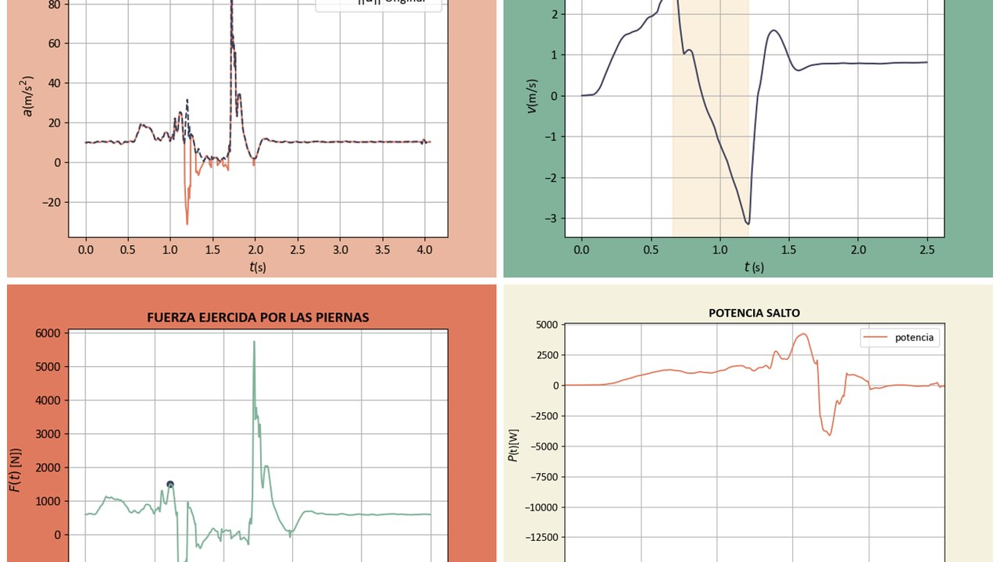

# Análisis de un salto vertical

[](https://skillicons.dev)

Calcula la altura, la fuerza, la velocidad y la potencia de un salto vertical a partir de los datos del acelerómetro de un móvil.



## Qué hace

- Lee las medidas del acelerómetro desde un Excel y suaviza la señal con un filtro de Savitzky-Golay.
- Localiza los puntos de interés del salto: impulso, aceleración máxima e impacto.
- Integra la aceleración para obtener velocidad, fuerza, potencia y altura, y guarda cada gráfica como imagen.

## Cómo ejecutarlo

```bash
pip install numpy pandas matplotlib openpyxl "scipy<1.14"
python física.py
```

El fichero de datos y la masa del saltador se cambian al principio del script (`fichero` y `masa`).

## Contenido

| Fichero | Qué es |
|---|---|
| `física.py` | Análisis completo y generación de gráficas |
| `quique.xlsx` | Medidas de un salto (tiempo y aceleración en los tres ejes) |
| `*.png` | Gráficas generadas: aceleración, señal suavizada, fuerza, velocidad y potencia |

---

Proyecto multidisciplinar de Programación, Matemáticas y Física del Grado en Tecnología Digital y Multimedia (UPV). Forma parte de mi [portfolio](https://quique-such.github.io/portafolio/).
